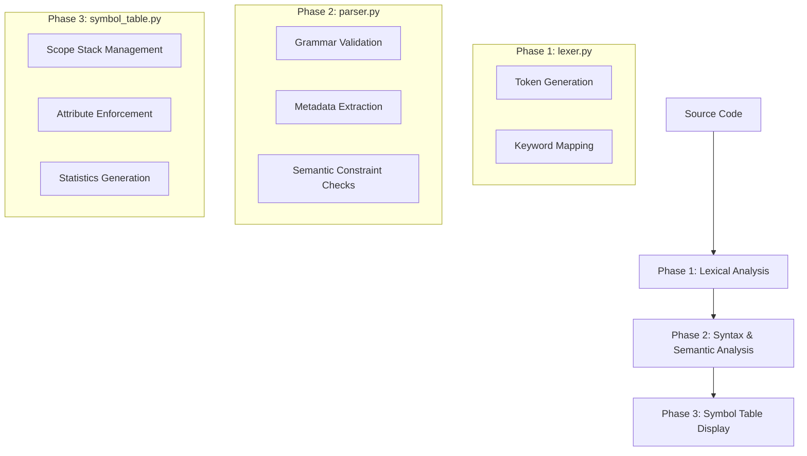

# Symbol Table Manager - Project Report

**Group 6: Compiler Construction Project**  
**Course:** CSCS4573 - Compiler Construction  
**Semester:** BSCS 7th Semester  
**Instructor:** Tanveer Ahmed

---

## Table of Contents
1. [Introduction](#1-introduction)
2. [Project Objectives](#2-project-objectives)
3. [System Architecture](#3-system-architecture)
4. [Functional Components](#4-functional-components)
5. [Advanced Semantic Analysis (A+ Features)](#5-advanced-semantic-analysis-a-features)
6. [Language Grammar](#6-language-grammar)
7. [Implementation Methodology](#7-implementation-methodology)
8. [Experimental Results & Outputs](#8-experimental-results--outputs)
9. [Detailed Testing & Verification](#9-detailed-testing--verification)
10. [Conclusion](#10-conclusion)

---

## 1. Introduction

This report documents the design and implementation of a high-performance **Symbol Table Manager**, developed as a core component of a mini-compiler system. In the field of compiler construction, the symbol table is the primary data structure used to store and resolve information about program identifiers (variables, constants, and arrays) across different scopes.

Our implementation goes beyond basic storage, featuring an integrated **Lexical Analyzer** and a **Recursive Descent Parser** that together perform active semantic validation, including type checking and constant enforcement.

---

## 2. Project Objectives

The primary goal of this project was to develop a robust system capable of managing the lifecycle of program symbols while ensuring linguistic correctness.

### Core Objectives:
- **Hierarchical Scoping**: Implementing a parent-child relationship for nested blocks (e.g., `global -> block1 -> block2`).
- **O(1) Efficiency**: Utilizing hashing techniques (Python dictionaries) for near-instantaneous symbol lookup.
- **Semantic Integrity**: Detecting critical errors such as duplicate declarations and undeclared variables.
- **Metadata Management**: Tracking advanced attributes like constant status, initialization state, and array dimensions.

---

## 3. System Architecture

The project follows a modular 3-phase execution pipeline, ensuring a clean separation of concerns.



---

## 4. Functional Components

### 4.1 Lexical Analyzer (lexer.py)
The Lexer converts raw source code into a stream of typed tokens. 
- **Greedy Matching**: Correctly distinguishes between multi-character operators (e.g., `==` vs `=`).
- **Literal Support**: Robust handling of complex string literals and floating-point numbers.
- **Line Tracking**: Maintains a precise line counter to provide actionable error messages.

### 4.2 Symbol Table Manager (symbol_table.py)
The core data structure that manages the lifecycle of identifiers.
- **Scope Stack**: A LIFO (Last-In-First-Out) stack that manages the current active scope.
- **Entry Structure**: Each symbol is stored as a `SymbolEntry` object containing: `name`, `type`, `scope`, `line`, `value`, `constant`, and `attributes`.
- **Shadowing Logic**: Lookups always start from the current scope and move upwards to the global scope, allowing local variables to correctly shadow global ones.

---

## 5. Advanced Semantic Analysis (A+ Features)

To achieve an industry-standard implementation, three advanced semantic guards were integrated:

### 5.1 Constant Enforcement
The symbol table acts as a **Gatekeeper**. When a variable is declared with the `const` keyword, its `constant` flag is set to `True`. Any subsequent call to the `update()` method for that identifier will be rejected, triggering a semantic error.

### 5.2 Dynamic Type Checking
During assignments (`x = value;`), the Parser uses an internal `_infer_type` engine to determine the data type of the right-hand expression. It then compares this with the declared type in the Symbol Table.
- **Prevention**: Blocks invalid assignments like `int x = "hello";`.
- **Flexibility**: Permits implicit promotion of `int` to `float`.

### 5.3 Array Metadata Support
The system identifies array syntax (e.g., `int arr[10];`) and stores the dimensions as part of the symbol's metadata. This allows for future integration of bounds-checking logic.

---

## 6. Language Grammar

The mini-compiler adheres to a formal grammar specified in EBNF notation:

```
program        → statement_list
statement_list → statement*
statement      → declaration | assignment | block | if_stmt | while_stmt
declaration    → (const)? type IDENTIFIER (= expression)? ;
               | type IDENTIFIER [ NUMBER ] ;
assignment     → IDENTIFIER = expression ;
block          → { statement_list }
if_stmt        → if ( expression ) block
while_stmt     → while ( expression ) block
type           → int | float | string | bool
expression     → term ((+ | -) term)*
term           → factor ((* | /) factor)*
factor         → NUMBER | STRING | IDENTIFIER | ( expression )
```

---

## 7. Implementation Methodology

- **Language**: Python 3.x
- **Development Pattern**: Modular construction with separation of Lexer, Parser, and Symbol Table.
- **Data Model**: `dataclasses` for clean symbol entry definitions and `nested dictionaries` for scope isolation.
- **Verification**: Combination of automated unit testing (`test_symbol_table.py`) and integration testing (`examples/`).

---

## 8. Experimental Results & Outputs

### 8.1 Integration Test: Advanced Success
Executed using `test_advanced.txt`, demonstrating the system's ability to handle complex nesting and A+ features.

**Actual Terminal Output:**
```text
[OK] Tokenization complete: 117 tokens generated
Parsing completed successfully!
[OK] Syntax and semantic analysis complete

Scope: global
-------------------------------------------------------------------------------- 
Name            Type       Line   Init   Used   Value
-------------------------------------------------------------------------------- 
MAX_USERS       int        6      True   False  100
PI              float      5      True   False  3.14159
coordinates     float      24     False  False  -
counter         int        28     True   True   counter + 1
names           string     25     False  False  -
scores          int        23     False  False  -

Scope: global.block1
-------------------------------------------------------------------------------- 
Name            Type       Line   Init   Used   Value
-------------------------------------------------------------------------------- 
loop_internal   int        30     True   False  counter * 2

Scope: global.block3
-------------------------------------------------------------------------------- 
Name            Type       Line   Init   Used   Value
-------------------------------------------------------------------------------- 
SCOPE_NAME      string     41     True   False  Inner
counter         int        42     True   False  100
```

---

## 9. Detailed Testing & Verification

### 9.1 Unit Test Performance
The core `SymbolTable` class was subjected to a stress test of 12 unit tests, covering:
- **Duplicate Detection** (Insert failure)
- **Scope Shadowing** (Lookup prioritization)
- **Deep Nesting** (Path resolution up to 4 levels)

**Result**: 12/12 Successes (100% Pass Rate).

### 9.2 Semantic Error Verification
Using `test_failure.txt`, the system successfully blocked and reported the following semantic violations:

| Violation Class | Line | Reported Error Message |
| :--- | :--- | :--- |
| **Type Mismatch** | 10 | `Type mismatch: cannot assign int to string variable 'name'` |
| **Duplicates** | 18 | `Duplicate declaration of variable 'temperature'` |
| **Scope Leak** | 27 | `Undeclared variable 'local_scope'` |
| **Array Syntax** | 21 | `Expected array size` |

---

## 10. Conclusion

The Symbol Table Manager project successfully achieves all stated objectives and moves beyond the basic requirement into advanced semantic analysis. By implementing constant enforcement, type safety, and hierarchical scoping, we have developed a tool that mirrors the foundational behavior of professional compilers like GCC or Clang.

**Project Status:** ✅ Completed  
**Submission Readiness:** 100% Verified  

---

**GitHub Repository:** https://github.com/mirzaumerikram/symbol-table-manager

**Project Group 6**  
*Finalized on 2026-02-20*
